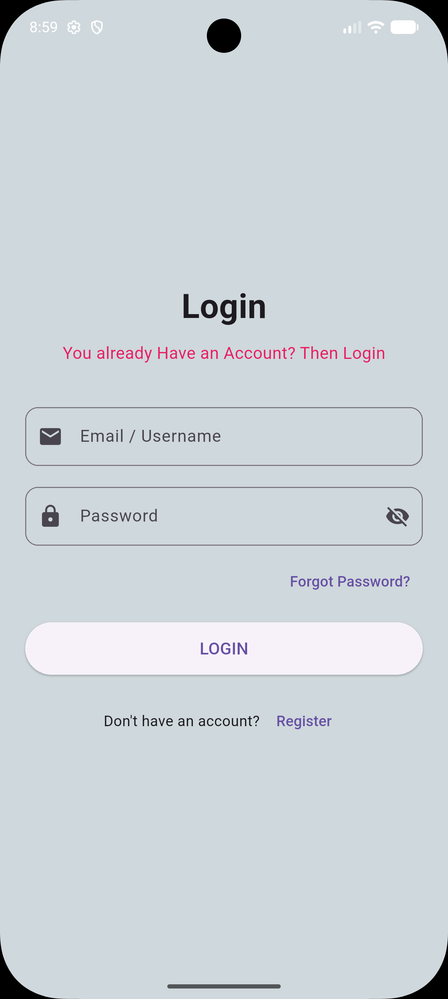
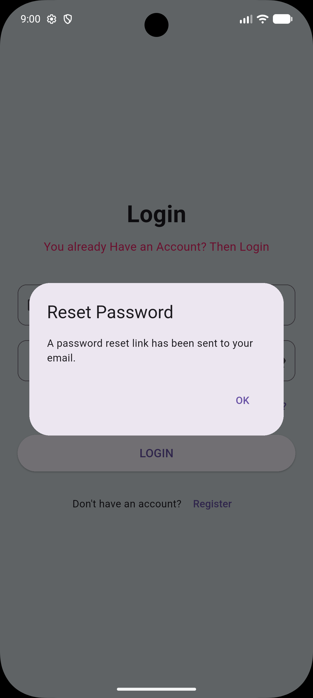
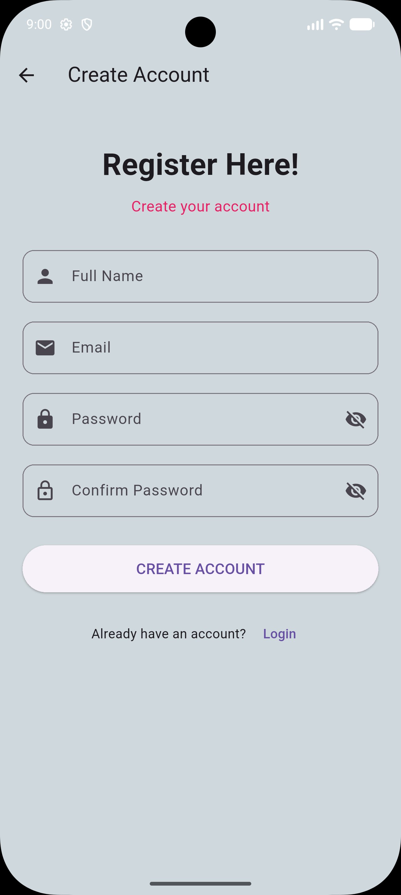

# Flutter Login and Registration Page
This is a clean and simple Login and Registration interface built with Flutter. It provides a foundational user interface for user authentication, featuring a modern, uniform look with custom form elements and responsive screen handling.

## Features
* **Authentication Screens:** Contains separate user interfaces for both logging in and creating a new account.
* **Password Visibility Toggle:** Allows users to hide or reveal their password fields interactively with the press of a button.
* **Responsive Layout:** Wrapped in scroll views to ensure the user interface scales properly on various screen sizes and does not break or overflow when the device keyboard appears.
* **Basic Alerts:** Includes a functioning alert dialog placeholder for the "Forgot Password" feature.
* **Seamless Navigation:** Implements clean routing between the login screen and registration screen using the standard Flutter Navigator framework.

## Project Structure
* `main.dart`: The initial entry point of the app that configures the global theme and targets the Login Page as the default home screen.
* `login_page.dart`: Contains the login form, password fields, forgot password triggers, and navigation redirects to register a new account.
* `registration_page.dart`: Contains the account creation form, input validation structures, and quick routing tools to navigate back to the login framework.

## Screenshots
## Login Page


## Forgot Password


## Registration Page


## Technologies Used
* **Framework:** Flutter (Latest Stable Release)
* **Language:** Dart
* **Design System:** Material Design 3 Styling
* **IDE:** Android Studio

## How to Run the Project

### Prerequisites
* Flutter SDK installed and configured on your computer.
* Android Studio or VS Code with the Dart and Flutter plugins installed.
* A running mobile emulator or a connected physical phone.

### Setup Instructions
1. Clone this repository to your local machine:
   ```bash
   git clone YOUR_GITHUB_REPOSITORY_LINK_HERE
   ```
2. Open the project root folder inside your terminal.
3. Fetch all required packages and dependencies:
   ```bash
   flutter pub get
   ```
4. Run the application on your active device:
   ```bash
   flutter run
   ```

